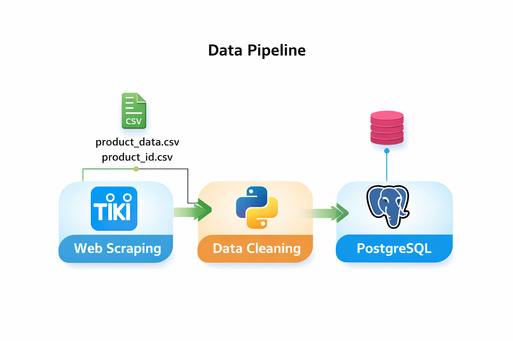

# 📚 TIKI BOOK DATA PIPELINE & ANALYSIS

## 1. Tổng quan dự án

Dự án này xây dựng **end-to-end data pipeline** cho dữ liệu sách từ trang **Tiki**, bao gồm:

- 🔍 Crawl dữ liệu sản phẩm (book) từ Tiki
- 🧹 Làm sạch & chuẩn hóa dữ liệu bằng **Python (Pandas, BeautifulSoup)**
- 🗄️ Lưu trữ dữ liệu vào **PostgreSQL**
- ⚡ Tối ưu truy vấn bằng **Index & pg_trgm**
- 📊 Phân tích dữ liệu bán hàng & doanh thu bằng SQL

Mục tiêu:
- Thực hành **Data Engineering / Big Data cơ bản**
- Xây dựng pipeline ETL hoàn chỉnh
- Áp dụng tối ưu truy vấn và phân tích dữ liệu thực tế

---

## 2. Kiến trúc Data Pipeline



```

Tiki Website
     │
     ▼
Web Crawling (Python)
     │
     ▼
Raw CSV (product_data.csv, product_id.csv)
     │
     ▼
Data Cleaning (Pandas + BeautifulSoup)
     │
     ▼
Clean CSV (tiki_book_clean.csv)
     │
     ▼
PostgreSQL (TIKI_BOOK)
     │
     ▼
SQL Analysis & Optimization
```

---

## 3. Cấu trúc thư mục

```
├── crawl/
│   ├── crawl_product_data.ipynb
│   └── crawl_product_id.ipynb
│
├── data_cleaning/
│   ├── processing_data.ipynb
│   ├── tiki_book_clean.csv
│   └── TIKI_BOOK.sql
│
├── dataset/
│   ├── product_data.csv
│   └── product_id.csv
│
└── README.md
```

---

## 4. Crawl dữ liệu từ Tiki

- Crawl **product_id** từ danh mục sách
- Từ `product_id` tiếp tục crawl chi tiết sản phẩm
- Dữ liệu thô được lưu dưới dạng CSV

**Công nghệ sử dụng:**
- Python
- Requests / BeautifulSoup
- Pandas

---

## 5. Làm sạch & xử lý dữ liệu (Data Cleaning)

### 5.1 Chuẩn hóa tên cột

- Đưa toàn bộ tên cột về chữ thường
- Loại bỏ ký tự đặc biệt (`_`, `.`, `%`)
- Đổi tên các cột cho đồng nhất

### 5.2 Xử lý giá trị null

- Xóa các cột có giá trị null hoàn toàn (`author_id`, `author_name`)
- Thay thế các giá trị null còn lại bằng `0`

### 5.3 Xóa dữ liệu trùng lặp

- Xóa các bản ghi trùng `id`

### 5.4 Chuyển đổi kiểu dữ liệu

- `quantity_sold` → `INT`

### 5.5 Làm sạch HTML

- Loại bỏ các thẻ HTML trong:
  - `description`
  - `infor_return`

Sử dụng **BeautifulSoup** để trích xuất text thuần.

### 5.6 Xuất dữ liệu sạch

- Xuất file: `tiki_book_clean.csv`

---

## 6. Thiết kế CSDL PostgreSQL

### 6.1 Tạo bảng

```sql
CREATE TABLE TIKI_BOOK (
    ID BIGINT PRIMARY KEY,
    SKU BIGINT,
    BOOK_NAME VARCHAR(500),
    ORIGIN_PRICE INT CHECK (ORIGIN_PRICE >= 0),
    DISCOUNT_RATE INT CHECK (DISCOUNT_RATE >= 0),
    DISCOUNT INT CHECK (DISCOUNT >= 0),
    PRICE INT CHECK (PRICE >= 0),
    DESCRIPTION VARCHAR(60000),
    QUANTITY_SOLD INT CHECK (QUANTITY_SOLD >= 0),
    CATEGORIES VARCHAR(100),
    INFOR_RETURN VARCHAR(100),
    GIFT_ITEM_TITLE VARCHAR(20),
    CHECK (ORIGIN_PRICE >= PRICE)
);
```

---

## 7. Tối ưu truy vấn (Indexing)

```sql
CREATE UNIQUE INDEX indx_book_sku ON TIKI_BOOK(SKU);
CREATE INDEX indx_book_categories ON TIKI_BOOK(CATEGORIES);
CREATE INDEX indx_book_price ON TIKI_BOOK(PRICE);
CREATE INDEX indx_book_quantity_sold ON TIKI_BOOK(QUANTITY_SOLD);
```

### 7.1 Tối ưu tìm kiếm LIKE / ILIKE

```sql
CREATE EXTENSION IF NOT EXISTS pg_trgm;
CREATE INDEX indx_book_name_trgm
ON TIKI_BOOK USING gin (BOOK_NAME gin_trgm_ops);
```

---

## 8. Đổ dữ liệu vào PostgreSQL

- Sử dụng **SQLAlchemy + psycopg2**
- Dữ liệu được append trực tiếp từ CSV vào bảng `TIKI_BOOK`

```python
df.to_sql(name='tiki_book', con=engine, if_exists='append', index=False)
```

---

## 9. Các truy vấn phân tích dữ liệu

### 9.1 Top sách bán chạy nhất

```sql
SELECT BOOK_NAME, CATEGORIES, QUANTITY_SOLD, PRICE,
       (QUANTITY_SOLD::BIGINT * PRICE::BIGINT) AS REVENUE
FROM TIKI_BOOK
ORDER BY QUANTITY_SOLD DESC
LIMIT 10;
```

### 9.2 Danh mục phổ biến nhất

```sql
SELECT CATEGORIES, COUNT(*) AS TOTAL_CR
FROM TIKI_BOOK
GROUP BY CATEGORIES
ORDER BY TOTAL_CR DESC;
```

### 9.3 Top danh mục có doanh thu cao nhất

```sql
SELECT CATEGORIES,
       SUM(PRICE::BIGINT * QUANTITY_SOLD::BIGINT) AS TOTAL_REVENUE,
       COUNT(*) AS TOTAL_CR,
       ROUND(AVG(PRICE), 0) AS AVG_PRICE
FROM TIKI_BOOK
GROUP BY CATEGORIES
ORDER BY TOTAL_REVENUE DESC;
```

### 9.4 Sách có giá cao nhất trong mỗi danh mục doanh thu cao

```sql
SELECT TK.CATEGORIES, TK.PRICE
FROM TIKI_BOOK TK
WHERE TK.CATEGORIES IN (
    SELECT CATEGORIES
    FROM TIKI_BOOK
    GROUP BY CATEGORIES
    ORDER BY SUM(PRICE::BIGINT * QUANTITY_SOLD::BIGINT) DESC
)
AND TK.PRICE = (
    SELECT MAX(T.PRICE)
    FROM TIKI_BOOK T
    WHERE T.CATEGORIES = TK.CATEGORIES
);
```

---

## 10. Phân tích Execution Plan

```sql
EXPLAIN ANALYZE
SELECT *
FROM TIKI_BOOK
WHERE CATEGORIES = 'Kinh Dịch Học'
  AND PRICE BETWEEN 100000 AND 300000;
```

→ Kiểm tra việc sử dụng index và hiệu năng truy vấn.

---

## 11. Công nghệ sử dụng

- **Python** (Pandas, BeautifulSoup)
- **PostgreSQL**
- **SQLAlchemy / psycopg2**
- **Jupyter Notebook**

---

## 12. Kết luận

Dự án mô phỏng một **Data Pipeline thực tế**, giúp:

- Hiểu rõ quy trình ETL
- Làm quen với xử lý dữ liệu lớn
- Tối ưu truy vấn PostgreSQL
- Phân tích dữ liệu bán hàng thực tế từ E-commerce

📌 Có thể mở rộng:
- Dùng **Airflow** để tự động hóa pipeline
- Chuyển sang **Data Warehouse (BigQuery / Redshift)**
- Kết nối **BI Tool (Power BI, Tableau)**

---

✍️ **Author:** Hoàng Minh Hải

